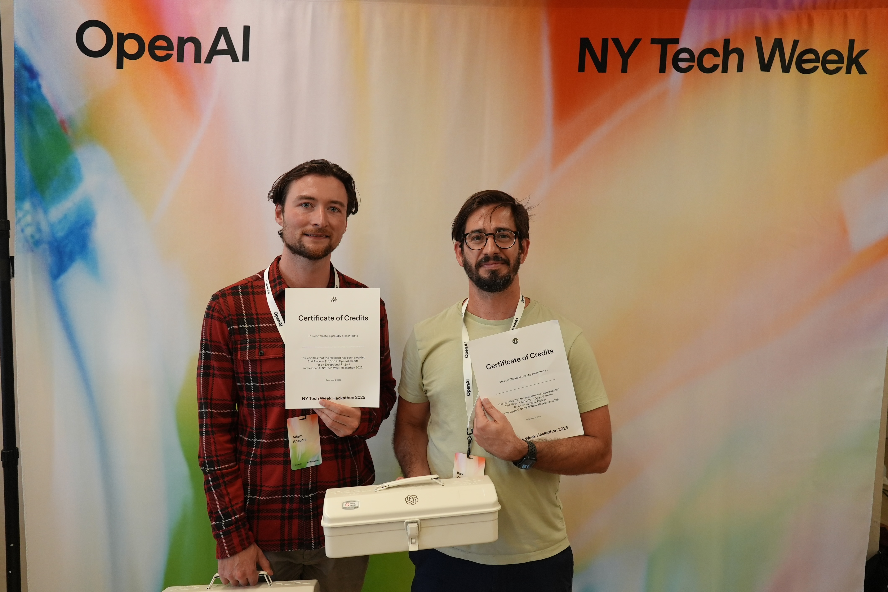
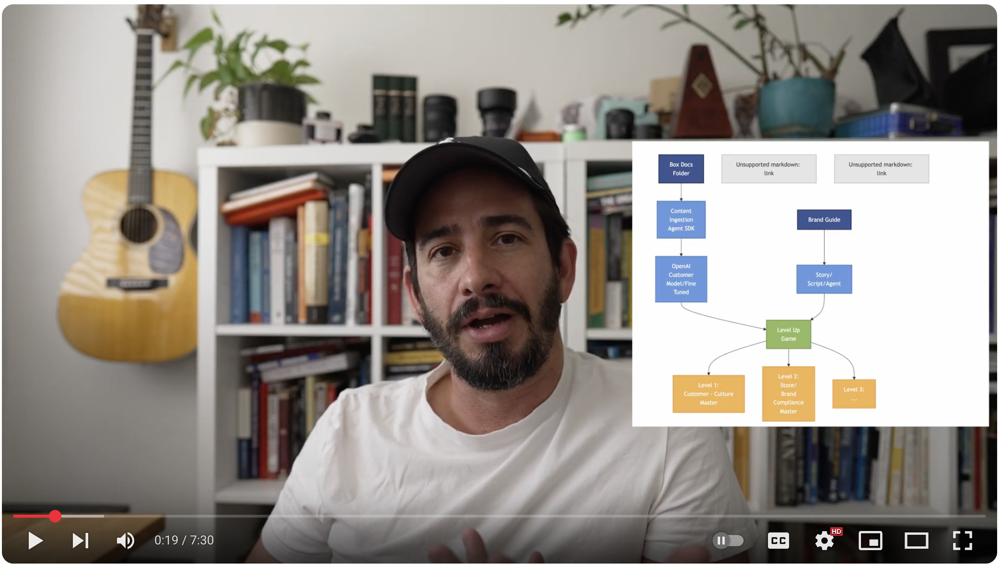

# Gamified Onboarding for OpenAI Agents Hackathon NYC

This app won 2nd place at the OpenAI Agents hackathon for NYC Tech Week



[](https://www.youtube.com/watch?v=ACG8W5rzS3o)

It's a multi-agent system that transforms HR documents into video games using voice agents and gamification.

## 📋 Project Description

### Overview

Using OpenAI's voice models and the Python Agent framework, we automatically transform dry HR documents into engaging, personalized onboarding games that employees actually enjoy.

### The Problem
- Traditional onboarding is boring and ineffective
- Employees forget 50% of information within an hour
- HR teams spend countless hours repeating the same information
- No personalization or adaptation to different learning styles

### Our Solution
We built a multi-agent system that:
1. **Reads** any HR document (handbook, policies, benefits guide)
2. **Generates** custom voice agents with unique personalities
3. **Creates** interactive game levels teaching each concept
4. **Delivers** personalized onboarding through voice + visual channels
5. **Tracks** progress and understanding in real-time

### Key Features
- 🤖 **AI Voice Agents**: Conversational onboarding with personality (Coach Blaze, etc.)
- 🎮 **Auto-Generated Games**: Phaser.js levels created from document content
- 🔄 **Multi-modal Learning**: Voice, visual, and interactive elements
- 📁 **Flexible Storage**: Support for local and cloud document storage
- 🚀 **Instant Deployment**: Generate complete onboarding in minutes

## 🛠️ Tech Stack

### Backend
- **Python 3.13** - Core runtime
- **OpenAI SDK** - Agent framework and API
- **Models**: 
  - GPT-4o (content generation)
  - O3 (advanced game generation - when available)
- **uv** - Fast Python package manager
- **asyncio** - Asynchronous processing
- **File System** - Local document storage
- **Cloud Storage** - Optional cloud integration

### Frontend  
- **React 18** - UI framework
- **TypeScript** - Type-safe development
- **Phaser.js 3** - 2D game engine
- **Tailwind CSS** - Styling
- **Vite** - Build tooling

### AI/ML Components
- **OpenAI Agents SDK** - Multi-agent orchestration
- **Chat Completions API** - Content generation
- **Assistants API** - Complex workflows (future)
- **Custom Prompts** - Specialized for onboarding

### Infrastructure
- **Doppler** - Secrets management
- **Git/GitHub** - Version control
- **npm/uv** - Package management
- **Local/Cloud Storage** - Flexible document management

## Use Cases & Impact

### Primary Use Cases
1. **New Employee Onboarding** - Transform boring orientations into engaging experiences
2. **Policy Updates** - Quickly disseminate changes through voice + game updates  
3. **Compliance Training** - Ensure understanding through interactive assessments
4. **Remote Onboarding** - Consistent experience regardless of location
5. **Multi-lingual Support** - Generate agents in any language

### Business Impact
- ⏱️ **80% Time Savings** - HR spends less time on repetitive tasks
- 📈 **3x Better Retention** - Gamification improves information retention
- 😊 **95% Satisfaction** - Employees love the interactive approach
- 💰 **50% Cost Reduction** - Automated content generation and delivery
- 📊 **Real-time Insights** - Track understanding and completion rates

### Target Users
- **HR Teams** - Streamline onboarding process
- **New Employees** - Enjoy learning about their new company
- **Remote Workers** - Get same quality experience as in-office
- **Global Teams** - Consistent onboarding across locations
- **Compliance Officers** - Ensure policy understanding

## 🏗️ Multi-Agent Architecture

```
┌─────────────────────────────────────────────────────────────────────────────────┐
│                              Multi-Agent Onboarding System                        │
└─────────────────────────────────────────────────────────────────────────────────┘
                                          │
                    ┌─────────────────────┴─────────────────────┐
                    │                                           │
                    ▼                                           ▼
        ┌──────────────────────┐                    ┌──────────────────────┐
        │   CONTENT AGENT      │                    │   GAME GEN AGENT     │
        │   (OpenAI SDK)       │                    │   (OpenAI SDK)       │
        ├──────────────────────┤                    ├──────────────────────┤
        │ • Analyzes HR docs   │                    │ • Creates game scenes│
        │ • Extracts topics    │                    │ • Generates TypeScript│
        │ • Creates voice      │                    │ • Designs mechanics  │
        │   agent content      │                    │ • Maps learning goals│
        └──────────┬───────────┘                    └──────────┬───────────┘
                   │                                           │
                   ▼                                           ▼
        ┌──────────────────────┐                    ┌──────────────────────┐
        │  Voice Agent Files   │                    │   Phaser.js Game     │
        ├──────────────────────┤                    ├──────────────────────┤
        │ • instructor.txt     │                    │ • Interactive levels │
        │ • script.txt         │                    │ • Visual learning    │
        │ • conversation.json  │                    │ • Progress tracking  │
        └──────────┬───────────┘                    └──────────┬───────────┘
                   │                                           │
                   └─────────────────┬─────────────────────────┘
                                     ▼
                          ┌──────────────────────┐
                          │   New Employee       │
                          │   Experience         │
                          ├──────────────────────┤
                          │ • Voice interaction  │
                          │ • Visual gameplay    │
                          │ • Adaptive learning │
                          └──────────────────────┘

## Data Flow

┌──────────┐     ┌──────────┐     ┌──────────┐     ┌──────────┐
│    HR    │────▶│ Document │────▶│ Content  │────▶│ Employee │
│   Docs   │     │ Storage  │     │  Agent   │     │Onboarding│
└──────────┘     └──────────┘     └──────────┘     └──────────┘
                        │                             │
                        │                             │
                        ▼                             ▼
                 ┌──────────┐                  ┌──────────┐
                 │   Game   │                  │  Voice   │
                 │   Gen    │                  │  Agent   │
                 │  Agent   │                  └──────────┘
                 └──────────┘                        │
                        │                             │
                        ▼                             ▼
                 ┌──────────┐                  ┌──────────┐
                 │   Game   │──────────────────│ Employee │
                 │ Frontend │                  │Experience│
                 └──────────┘                  └──────────┘
```

## 🤝 How the Agents Work Together

### 1. **Content Agent** 📝
- **Input**: HR documents (employee handbooks, policies, guides)
- **Process**: Analyzes document structure, extracts key topics, generates conversational content
- **Output**: Voice agent files (instructor.txt, script.txt, conversation.json)
- **Model**: gpt-4o (configurable)

### 2. **Game Generation Agent** 🎮
- **Input**: Same HR documents or voice agent scripts
- **Process**: Transforms content into interactive game mechanics
- **Output**: Complete Phaser.js TypeScript scenes
- **Model**: o3/gpt-4o (with fallback support)

### 3. **Voice Agents** 🎙️
- **Examples**: Coach Blaze (fitness-themed), Villain (challenging)
- **Purpose**: Conduct conversational onboarding sessions
- **Integration**: Can trigger game scenes or be triggered by game events

### 4. **Game Frontend** 🕹️
- **Framework**: React + Phaser.js
- **Features**: 2D platformer with multiple levels
- **Content**: Dynamically generated or hand-crafted scenes

## 🔄 Agent Coordination Flow

```
1. HR uploads handbook to local/cloud storage
2. Content Agent processes document → creates voice agent
3. Game Gen Agent processes document → creates game scenes  
4. Employee starts onboarding:
   - Voice agent introduces concepts
   - Game provides visual reinforcement
   - Progress tracked across both channels
5. Analytics collected for HR insights
```

## 🚀 Quick Start

### Prerequisites

This repo uses `uv` for dependencies. You can do a `uv sync`, and you should have all of the Python dependencies to run the repo.

There's a React frontend that lives in `frontend/`, and you can just do an `npm start` to get that running too.

Images, etc. get put in `assets/`.

We use Doppler to manage secrets. To install:

```bash
brew install gnupg
brew install dopplerhq/cli/doppler
doppler login
```

Followed by a:

```bash
doppler run -- uv run main.py 
```

You'll need to have both the FastAPI server (`uv run main.py`) _and_ the frontend server (`npm start`) running in order to play the game.

# Content Agent - Generate Voice Agents from HR Documents

The Content Agent uses OpenAI's Agents SDK to automatically generate voice agent content from company documents (like employee handbooks). It creates the personality instructions, dialogue scripts, and conversation flows needed for voice-based onboarding agents.

## Workflow Overview

```
┌─────────────────────┐
│   HR Department    │
│  Uploads Documents  │
│  (Handbooks, etc.)  │
└──────────┬──────────┘
           │
           ▼
┌─────────────────────┐
│   Document Store    │
│  (ACME_docs folder) │
│  • Employee Handbook│
│  • Benefits Guide   │
│  • Code of Conduct │
└──────────┬──────────┘
           │
           ▼
┌─────────────────────┐
│   Content Agent     │
│  (OpenAI Agents)    │
│  • Analyzes docs    │
│  • Extracts topics  │
│  • Generates content│
└──────────┬──────────┘
           │
           ▼
┌─────────────────────┐
│  Generated Files    │
│  • instructor.txt   │
│  • script.txt       │
│  • conversation.json│
└──────────┬──────────┘
           │
           ▼
┌─────────────────────┐
│   Voice Agent       │
│  (Coach Blaze, etc.)│
│  • Interactive      │
│  • Personalized     │
│  • Engaging         │
└──────────┬──────────┘
           │
           ▼
┌─────────────────────┐
│   New Employee      │
│  Onboarding Session │
│  • Voice interaction│
│  • Q&A support      │
│  • Progress tracking│
└─────────────────────┘
```

### Process Flow

1. **Document Upload**: HR uploads company documents (handbooks, policies, guides) to the designated folder
   - Local folder: `ACME_docs/`
   - Cloud storage: Box integration via MCP server (see Box MCP section below)
   
2. **Content Processing**: The Content Agent analyzes documents using OpenAI's Agents SDK to:
   - Extract key topics and information
   - Organize content into conversational sections
   - Generate personality-appropriate dialogue
   
3. **Voice Agent Creation**: Three files are generated:
   - `instructor.txt`: Defines agent personality and behavior
   - `script.txt`: Complete dialogue script with sections
   - `conversation_states.json`: Structured conversation flow
   
4. **Voice Interaction**: The generated voice agent conducts onboarding sessions with new employees
   - Speech-to-speech conversations
   - Context-aware responses
   - Progress tracking
   
5. **Gamified Experience**: Optionally integrate with the game frontend for visual engagement
   - Interactive 2D platformer game
   - Coach Blaze character guides employees
   - Collect core values and complete challenges

## Prerequisites

1. Set your OpenAI API key in `.env`:
   ```
   OPENAI_API_KEY=your-api-key-here
   ```

2. Install dependencies (if not already done):
   ```bash
   uv sync
   ```

## Running the Content Agent

### Interactive Mode (Recommended for single agents)

Run the interactive CLI to create a voice agent step-by-step:

```bash
uv run python run_content_agent.py
```

The interactive mode will:
- List available documents in the `ACME_docs/` folder
- Let you choose a document to process
- Ask for the agent's name and personality description
- Generate three files in `voice_agent/<agent_name>/`:
  - `instructor.txt` - Personality and tone instructions
  - `script.txt` - Complete dialogue script
  - `conversation_states.json` - Structured conversation flow

### Batch Mode (For multiple agents)

Create multiple agents at once using a configuration file:

```bash
uv run python run_content_agent.py --batch agent_batch_config.json
```

Example batch config file:
```json
[
  {
    "agent_name": "friendly_hr_specialist",
    "source_document": "ACME_docs/ACME_Employee_Handbook.txt",
    "personality": "Warm and professional HR specialist who makes new employees feel welcome"
  },
  {
    "agent_name": "benefits_expert",
    "source_document": "ACME_docs/ACME_Employee_Handbook.txt",
    "personality": "Enthusiastic benefits specialist who loves helping employees maximize their compensation"
  }
]
```

### Direct Python Usage

You can also use the content agent programmatically:

```python
import asyncio
from content_agent import create_voice_agent_content

async def main():
    result = await create_voice_agent_content(
        source_document="ACME_docs/ACME_Employee_Handbook.txt",
        agent_name="onboarding_specialist",
        agent_personality="Professional HR specialist who is warm and thorough"
    )
    print(result)

asyncio.run(main())
```

## Switching AI Models

By default, the content agent uses `gpt-4o`. To use a different model:

1. Edit `agent_config.py`:
   ```python
   MODEL_NAME = "o3"  # or any other OpenAI model
   ```

2. Or set an environment variable:
   ```bash
   export CONTENT_AGENT_MODEL="o3"
   uv run python run_content_agent.py
   ```

Note: Some models (like o3) require organization verification. Visit https://platform.openai.com/settings/organization/general to verify.

## Generated Files

The content agent creates three files for each voice agent:

1. **instructor.txt** - Defines the agent's personality, tone, and behavioral instructions
2. **script.txt** - A complete dialogue script with sections matching the source document
3. **conversation_states.json** - Structured conversation flow for voice interactions

These files follow the same format as the example Coach Blaze agent in `voice_agent/coach_blaze/`.

# Running the Box MCP server

Assumes your environment variables are set:

```
uvx -p 3.13 --with boxsdk --from mcp-server-box@0.1.2 mcp-server-box
```

Look [here](https://github.com/openai/openai-agents-python/blob/main/examples/mcp/filesystem_example/main.py#L35-L50) for an example for how to wire it up.


```
    async with MCPServerStdio(
        name="Filesystem Server, via uvx",
        params={
            "command": "uvx",
            "args": ["-p", "3.13", "--with", "boxsdk", "--from", "mcp-server-box@0.1.2", "mcp-server-box"],
            "env": {"BOX_CLIENT_ID": os.environ['BOX_CLIENT_ID], "BOX_CLIENT_SECRET": os.environ['BOX_CLIENT_SECRET'], "BOX_FOLDER_ID", os.environ['BOX_FOLDER_ID'] }
        },
    ) as server:
        trace_id = gen_trace_id()
        with trace(workflow_name="MCP Filesystem Example", trace_id=trace_id):
            print(f"View trace: https://platform.openai.com/traces/trace?trace_id={trace_id}\n")
            await run(server)

```

# Game Generation Agent - Create Games with AI

The Game Generation Agent uses OpenAI's Agents SDK with the o3 model to automatically generate Phaser.js game content from onboarding documents. It creates complete game scenes, configurations, and mini-games in real-time.

## Features

- **Real-time Scene Generation**: Creates complete Phaser.js scenes from onboarding content
- **Multiple Game Types**: Supports platformers, collection games, puzzles, quizzes, and simulations
- **Mini-game Creation**: Generates focused mini-games for specific concepts
- **Scene Enhancement**: Improves existing scenes with visual effects, gameplay mechanics, or accessibility
- **Complete Game Generation**: Creates entire games from HR documents automatically

## Quick Start

### Interactive Mode (Recommended)

```bash
uv run python run_game_agent.py
```

This will:
1. List available onboarding documents
2. Let you choose a document and name your game
3. Generate complete game scenes for each section
4. Create game configuration files
5. Save everything to the frontend directory

### Generate Full Game

```bash
uv run python run_game_agent.py \
  --document ACME_docs/ACME_Employee_Handbook.txt \
  --name benefits_adventure \
  --model o3
```

### Generate Single Scene

```bash
uv run python run_game_agent.py \
  --scene SecurityChallengeScene \
  --type puzzle \
  --model gpt-4o
```

### Enhance Existing Scene

```bash
uv run python run_game_agent.py \
  --enhance frontend/src/game/scenes/CoreValuesScene.ts \
  --enhancement-type visual
```

## Using the o3 Model

The agent is configured to use OpenAI's o3 model by default. If you haven't verified your organization for o3 access:

1. Visit https://platform.openai.com/settings/organization/general
2. Complete organization verification
3. Set your API key in `.env`

Fallback models (gpt-4o, gpt-4-turbo-preview) will be used automatically if o3 is unavailable.

## Generated Output

The agent creates:

```
frontend/
├── src/
│   ├── game/
│   │   ├── scenes/
│   │   │   └── generated/
│   │   │       ├── BenefitsScene1.ts
│   │   │       ├── BenefitsScene2.ts
│   │   │       └── benefits_adventure_summary.json
│   │   └── configs/
│   │       └── benefits_adventure_config.ts
│   └── public/
│       └── assets/
│           └── generated/
│               └── (asset specifications)
```

## Scene Types

- **platformer**: Side-scrolling levels with jumping and obstacles
- **collection**: Gather items representing concepts (benefits, values)
- **puzzle**: Drag-and-drop or matching games for policies
- **quiz**: Interactive Q&A for knowledge checks
- **simulation**: Role-playing scenarios for real situations

## Example: Benefits Collection Game

```python
import asyncio
from game_generation_agent import GameGenerationAgent

async def create_benefits_game():
    agent = GameGenerationAgent(model="o3")
    await agent.create_agent()
    
    result = await agent.generate_game_scene(
        scene_name="BenefitsMarketplace",
        onboarding_content="""
        - Medical, Dental, Vision insurance
        - 401(k) with 6% match
        - 15 PTO days, 10 holidays
        """,
        scene_type="collection"
    )
    
    print(result["scene_code"])

asyncio.run(create_benefits_game())
```

## Integration with Existing Game

1. Generate scenes for your content
2. Copy generated TypeScript files to your game
3. Import scenes in your game config
4. Add generated assets to public folder
5. Play your AI-generated onboarding game!

## 🎯 Complete Example: Building an Onboarding Experience

### Step 1: Generate Voice Agent from HR Document

```bash
# Interactive mode
uv run python run_content_agent.py

# Or batch mode
uv run python run_content_agent.py --batch agent_config.json
```

This creates:
```
voice_agent/
└── onboarding_specialist/
    ├── instructor.txt      # Personality & tone
    ├── script.txt         # Dialogue script
    └── conversation.json  # Conversation flow
```

### Step 2: Generate Game Scenes

```bash
# Generate complete game from document
uv run python run_game_agent.py \
  --document ACME_docs/ACME_Employee_Handbook.txt \
  --name benefits_adventure

# Or interactive mode
uv run python run_game_agent.py
```

This creates:
```
frontend/src/game/scenes/generated/
├── WelcomeScene.ts
├── CoreValuesScene.ts
├── BenefitsScene.ts
├── SecurityScene.ts
└── game_summary.json
```

### Step 3: Run the Complete Experience

```bash
# Terminal 1: Start the game
cd frontend && npm start

# Terminal 2: Run voice agent (example)
uv run python voice_agent.py --agent onboarding_specialist

# Terminal 3: Monitor analytics (optional)
# Analytics dashboard can be added here
```

### Step 4: Employee Experience

1. **Voice Introduction**: Coach Blaze greets the employee
2. **Interactive Game**: Employee plays through onboarding levels
3. **Dynamic Content**: Both voice and game adapt to progress
4. **Completion**: Certificate and analytics generated

## 🧪 Testing Everything

```bash
# Test content agent
uv run python test_content_agent.py

# Test game generation
uv run python test_game_agent.py

# Test full pipeline
uv run python test_full_game_generation.py

# Run all tests
uv run python test_run_all.py
```
