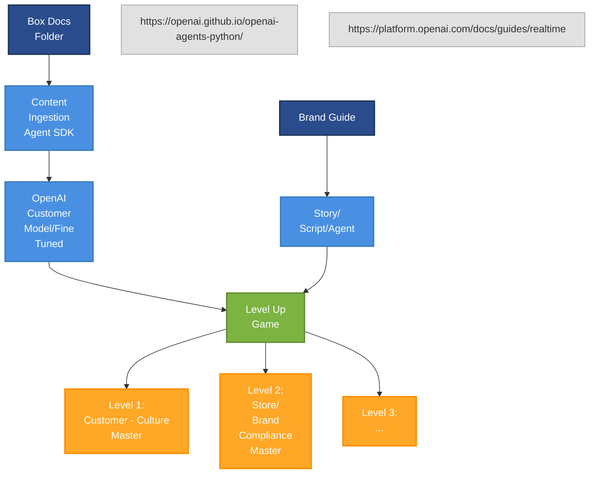

# Level Up Game Architecture

## Architecture Diagram

## Overview

This document describes the system architecture for the Level Up game onboarding application, which integrates various components to deliver adaptive game content based on brand guidelines and player engagement.

## Architecture Components

### Data Sources

1. **Box Docs Folder**
   - Repository for brand guidelines and content documentation
   - Source of truth for brand voice, style, and messaging

2. **Brand Guide**
   - Contains brand standards, voice, and tone guidelines
   - Defines visual and content requirements
   - Ensures consistency across all game elements

### Content Processing Pipeline

#### Content Ingestion
- **Content Ingestion Agent SDK**
  - Retrieves documents from Box Docs Folder
  - Processes brand guidelines and content requirements
  - Generates structured data for downstream processing

#### AI-Powered Content Generation
- **OpenAI Customer Model/Fine-Tuned**
  - Custom model trained on brand-specific content
  - Generates game scripts and narratives
  - Creates adaptive content based on player behavior

### Game Delivery

#### Story/Script/Agent
- Generates dynamic game narratives
- Adapts content based on player interactions
- Delivers personalized gaming experiences

#### Level Up Game
- **Level 1: Customer - Culture Master**
  - Introductory level focusing on brand culture
  - Player learns core brand values
  
- **Level 2: Store/Brand Compliance Master**
  - Advanced level testing brand compliance knowledge
  - Player demonstrates understanding of brand standards
  
- **Level 3: Additional future levels**
  - Expandable framework for additional training modules

## Data Flow

1. Brand guidelines and content documents are stored in Box Docs Folder
2. Content Ingestion Agent SDK retrieves and processes these documents
3. Processed content feeds into OpenAI custom model for content generation
4. Generated scripts and narratives power the Level Up game experience
5. Players progress through levels, mastering brand culture and compliance

## Integration Points

- **https://openai.github.io/openai-agents-python/** - OpenAI Agents SDK integration
- **https://platform.openai.com/docs/guides/realtime** - Real-time content generation capabilities

## Benefits

- Automated content generation aligned with brand guidelines
- Adaptive learning experiences based on player performance
- Scalable framework for adding new training modules
- Consistent brand messaging across all game elements